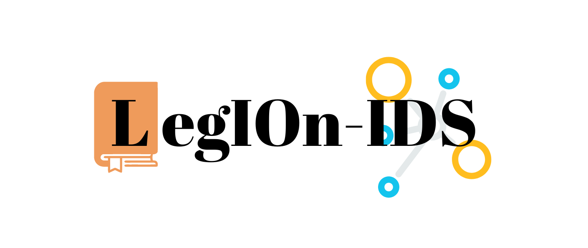
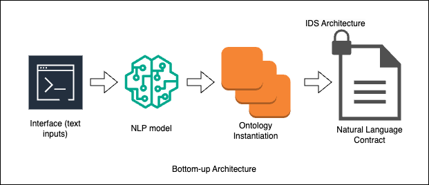

# Towards Legal Interoperability in International Data Spaces Archive

This Repository provides the archive of the ongoing work towards the definition of a protocol that enables legal interoperbility within the International Data Spaces architecture. As an ongoing work, we report our results as follows.

## Academic Papers:

* A Systematic Literature Review <a href="./Systematic Literature Review/ESWA_towards_legal_interoperability_SLR (1).pdf" download>(download)</a>

* A short paper eliciting the Design Science Research methodology <a href="./Position Papers/ICEIS_position_paper_final.pdf" download>(download)</a>

## Artifacts

* Legal Interoperability Ontology for International Data Spaces (LegIOn-IDS)

<a>
    </img>
</a>

# Our Goal

* Bottom-Up: To provide a framework in which, a machine learning model will be able to provide the textual classification of the given contract, and results in its legal moments, unambiguously representing it, in a machine readable way. 

* Top-Bottom: To provide a framework in which, lawyers could use the ontology to input the clauses of the contract, using the ontology as fundamental schema of relations, and through a machine learning model, generate a model of contract (fostering the data as a service and data purchase kinds of contract, at first), as graphically represented in the figure below.

    </img>

